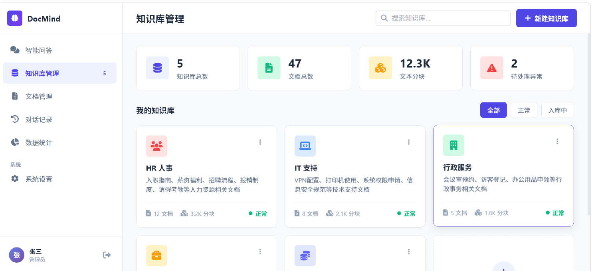
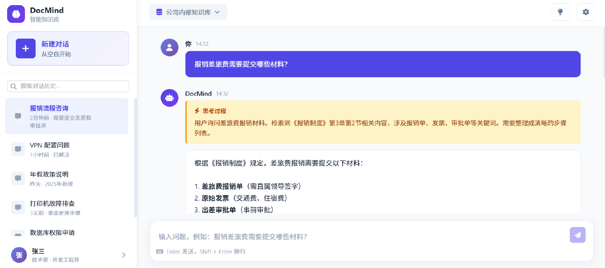

# PRD — 产品需求文档

| 属性 | 值 |
|:---|:---|
| 文档版本 | v0.2 |
| 最后更新 | 2026-05-11 |
| 作者 | yuz |
| 状态 | 草稿 |

---

## 1. 项目概述

**DocMind** — 企业内部知识库智能问答平台。员工用自然语言提问，系统从文档中语义检索，由 LLM 生成可溯源的答案。

核心价值：**你不必知道文档在哪、叫什么名字、关键词是什么，问就行。**

### 1.1 对标参考

设计思路对齐 **Ragent AI**（Java 企业级 RAG 平台），本项目用 Python 生态重新实现核心设计。
主要原型图：

登录页:

注册页：

后台页:

聊天页1:

聊天页2:

---

## 2. 业务背景与痛点

**场景：中型互联网公司（300+ 员工，6 个部门）的"信息孤岛"问题。**

公司日常运转依赖大量制度文档和业务规范，散落在各个角落：

| 部门 | 文档类型 |
|:---|:---|
| HR | 入职指南、薪资福利、报销流程、请假制度、招聘 SOP |
| IT | VPN 配置、打印机使用说明、系统权限申请、故障排查 |
| 行政 | 会议室预约、访客登记、办公用品申领 |
| 业务 | 接口文档、数据安全规范、合规检查清单 |
| 财务 | 开票信息、采购审批制度 |

**4 大核心痛点：**

1. **新人入职成本高** — 新员工面对海量 Wiki 不知道从哪看起，"报销打车费要填什么表"需翻 5-10 分钟文档或反复问 HR
2. **文档检索效率低** — 全文搜索只做关键词匹配。搜"墨盒怎么换"匹配不到"打印机耗材更换步骤"，搜"加班调休"漏掉"弹性工作制与补休规则"
3. **跨部门知识获取困难** — 技术查报销规则要翻财务文档，运营查安全规范要翻合规文档，找不到或版本已过时
4. **重复问答消耗人力** — HR 和 IT 支持人员每天回答大量重复问题，答案明明写在文档里

---

## 3. 典型使用场景

| 角色 | 场景 | 传统方式 | DocMind |
|:---|:---|:---|:---|
| 新入职员工 | "报销差旅费需要提交哪些材料？" | 翻 Wiki 10 分钟，或问 HR 等回复 | 输入问题，5 秒得到答案并附源文档 |
| 技术开发 | "生产环境数据库密码怎么申请？" | 不知道找哪个文档，问了一圈人 | 检索 IT 规范文档，直接定位申请流程 |
| HR | "2025 年的年假政策相比去年有什么变化？" | 翻历史版本文档对比 | 自动检索相关段落并对比 |
| 运维 | "服务器安全基线检查有哪些项目？" | 翻安全规范 PDF 逐条看 | 自然语言提问，按检查项返回 |

---

## 4. 目标用户

| 角色 | 权限级别 | 核心需求 |
|:---|:---|:---|
| 普通员工 | user | 提问获取答案，查看引用源文档 |
| 知识库管理员 | admin | 管理知识库、上传文档、查看入库状态、查看使用统计 |

> TODO: [待补充] 用户画像 Persona — 建议包含 2-3 个典型角色的详细画像（姓名、部门、技术熟练度、使用频率、核心目标）。

---

## 5. 验收标准

> TODO: [待补充] 各 Phase 可量化的验收标准，例如：
> - 单次问答端到端延迟 < 5 秒（含检索 + LLM 生成）
> - 检索 Recall@5 ≥ 0.85（在回归测试集上）
> - 答案相关性人工评分平均 ≥ 4.0/5.0
> - 文档入库成功率 ≥ 99%（不含格式不支持的预期失败）
> - 并发 10 用户下系统不降级

---

## 6. 相关文档

- [架构设计文档](ARCHITECTURE.md)
- [数据库设计文档](../backend/docs/DATABASE.md)
- [接口文档](../backend/docs/API.md)
- [开发指南](DEVELOPMENT.md)
- [开发排期](ROADMAP.md)
- [测试策略](TESTING.md)
- [UI 设计规范](../frontend/docs/UIDESIGN.md)
